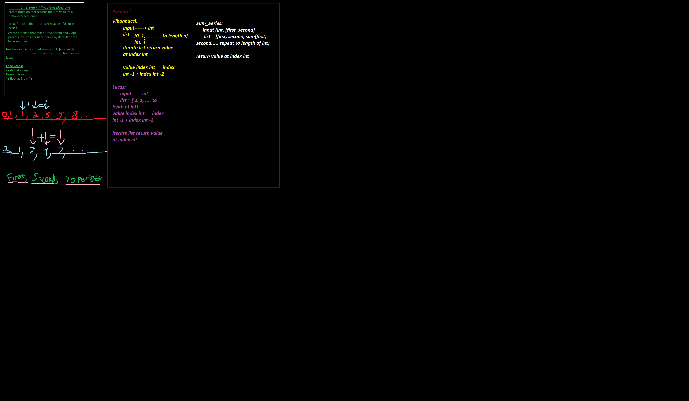

# Math Series Fibbonacci, Lucas and unit testing

purpose of this project is to accuaint myself with writing tests before writing the code in accord with TDD principles.

## Table of Contents
[math-series](math_series/series.py)
  - [Pull Request](https://github.com/MasonChance/math-series/pull/1)
  - [deployed URL](https://masonchance.github.io/math-series/.)
  - 